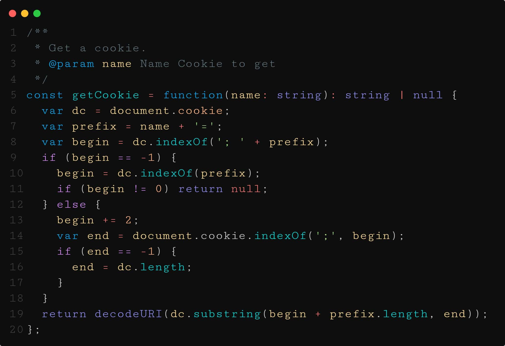
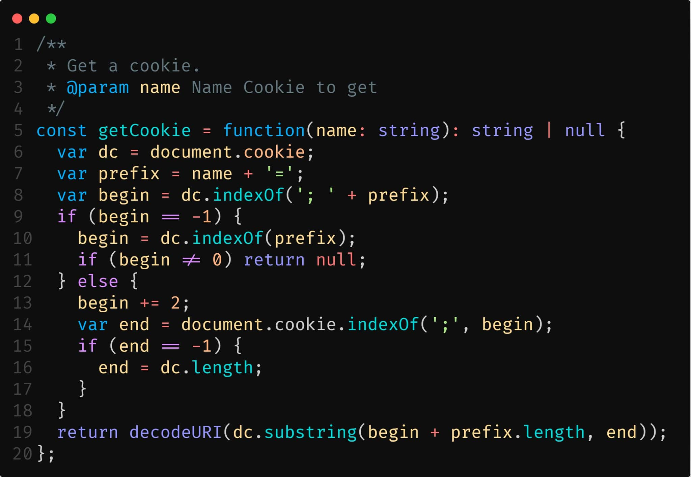

# Favorites Monospace Fonts
This is a list of my favorite programming monospaced fonts.

## Table of content
+ [Andale Mono](###Andale-Mono)
+ [Anonymous Pro](###Anonymous-Pro)
+ [Bitstream Vera Sans Mono](###Bitstream-Vera-Sans-Mono)
+ [Cascadia Code](###Cascadia-Code)
+ [Courier Prime Code](###Courier-Prime-Code)
+ [Cousine](###Cousine)
+ [Curive Mono](###Curive-Mono)
+ [Dank Mono](###Dank-Mono)
+ [DejaVu Sans Mono](###DejaVu-Sans-Mono)
+ [DM Mono](###DM-Mono)
+ [Droid Sans Mono](###Droid-Sans-Mono)
+ [Edlo](###Edlo)
+ [Everson Mono](###Everson-Mono)
+ [Fire Code](###Fire-Code)
+ [Fira Cousine](###Fira-Cousine)
+ [Generic Mono](###Generic-Mono)
+ [Hack](###Hack)
+ [Hasklig](###Hasklig)
+ [Inconsolata](###Inconsolata)
+ [JetBrains Mono](###JetBrains-Mono)
+ [Kawkab Mono](###Kawkab-Mono)
+ [Liberation Mono](###Liberation-Mono)
+ [Mensch](###Mensch)
+ [Meslo LG M DZ](###Meslo-LG-M-DZ)
+ [Metrickal](###Metrickal)
+ [Monofur](###Monofur)
+ [NanumGothicCoding](###NanumGothicCoding)
+ [Office Code Pro](###Office-Code-Pro)
+ [Overpass Mono](###Overpass-Mono)
+ [Oxygen Mono](###Oxygen-Mono)
+ [Panic Sans](###Panic-Sans)
+ [Roboto Mono](###Roboto-Mono)
+ [SF Mono Regular](###SF-Mono-Regular)
+ [Sometype Mono](###Sometype-Mono)
+ [Source Code Pro](###Source-Code-Pro)
+ [Color Theme Using](###Color-Theme-Used)

### Andale Mono

### Anonymous Pro

### Bitstream Vera Sans Mono

### Cascadia Code

### Courier Prime Code

### Cousine

### Curive Mono

### Dank Mono

### DejaVu Sans Mono

### DM Mono

### Droid Sans Mono

### Edlo

### Everson Mono

### Fire Code

### Fira Cousine

### Generic Mono

### Hack

### Hasklig

### Inconsolata

### JetBrains Mono

### Kawkab Mono

### Liberation Mono

### Mensch

### Meslo LG M DZ

### Metrickal

### Monofur

### NanumGothicCoding

### Office Code Pro

### Overpass Mono

### Oxygen Mono

### Panic Sans

### Roboto Mono

### SF Mono Regular

### Sometype Mono

### Source Code Pro

### Color Theme Used
All screeshot code use the color theme [Night Wolf Theme](https://marketplace.visualstudio.com/items?itemName=MaoSantaella.night-wolf).